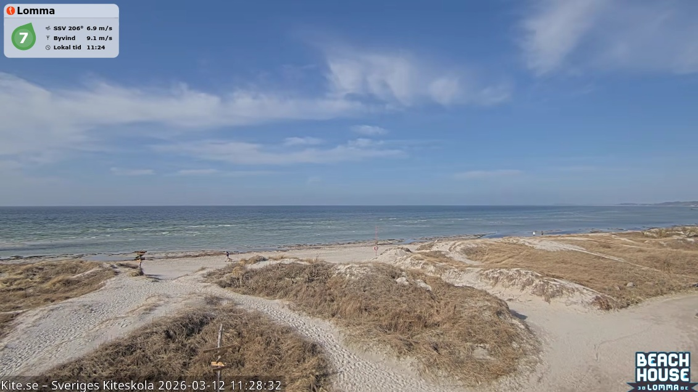
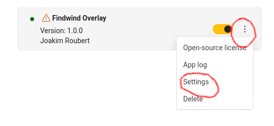
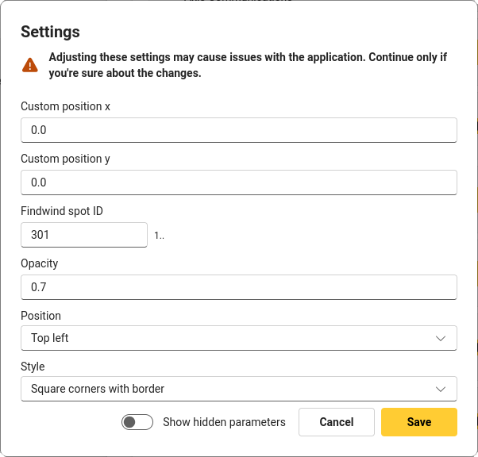
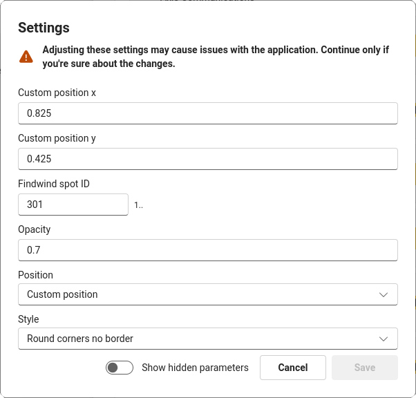

# FindWind ACAP

[](https://github.com/d97jro/findwind-acap/actions/workflows/build.yml)
[](https://github.com/d97jro/findwind-acap/actions/workflows/linter.yml)

**This repository contains the source code to build a small example
[ACAP version 4](https://axiscommunications.github.io/acap-documentation/)
(native) application that overlays wind information from
[FindWind](https://findwind.se) on
[Axis camera](https://www.axis.com/products/network-cameras)
video streams.**



## Build

The build process uses the [ACAP SDK build container](https://hub.docker.com/r/axisecp/acap-sdk) and Docker or Podman.

The Docker and Podman commands are integrated in the [Makefile](Makefile), so if you have Docker or Podman and `make` on your computer all you need to do is:

```sh
make dockerbuild
```

or

```sh
make podmanbuild
```

or perhaps build in parallel:

```sh
make -j dockerbuild
```

alternatively

```sh
make -j podmanbuild
```

If you do have Docker but no `make` on your system:

```sh
# 32-bit ARM, e.g. ARTPEC-6- and ARTPEC-7-based devices
DOCKER_BUILDKIT=1 docker build --build-arg ARCH=armv7hf -o type=local,dest=. .
# 64-bit ARM, e.g. ARTPEC-8 and ARTPEC-9-based devices
DOCKER_BUILDKIT=1 docker build --build-arg ARCH=aarch64 -o type=local,dest=. .
```

If you do have Podman but no `make` on your system:

```sh
# 32-bit ARM, e.g. ARTPEC-6- and ARTPEC-7-based devices
podman build --build-arg ARCH=armv7hf -o type=local,dest=. .
# 64-bit ARM, e.g. ARTPEC-8 and ARTPEC-9-based devices
podman build --build-arg ARCH=aarch64 -o type=local,dest=. .
```

## Setup

> [!IMPORTANT]
> Changes to the application settings will take effect during the next
> scheduled forecast update. If you want them to apply immediately, you will
> need to restart the application.

### Manual installation and configuration

Upload the ACAP application file (the file with the `.eap` extension for the camera's architecture) through the camera's web UI: *Apps->Add app*

When installed, start the application.

Open the application's settings dialog in the web interface by clicking the
three vertical dots button.



In the settings page you can configure the FindWind spot ID, style, opacity, and position of the overlay.



> [!IMPORTANT]
> If you use a custom position (and none of the predefined
> *topLeft/topRight/bottomLeft/bottomRight*), the anchor point is the
> overlay's upper left corner. The coordinates range from (-1.0, -1.0),
> being the upper left corner of the screen, and (1.0, 1.0) being the
> bottom right corner of the screen.



### Scripted installation and configuration

Use the camera's [applications/upload.cgi](https://www.axis.com/vapix-library/subjects/t10102231/section/t10036126/display?section=t10036126-t10010609) to upload the ACAP application file (the file with the `.eap` extension for the camera's architecture):

```sh
curl -k --anyauth -u root:<password> \
    -F packfil=@findwind_<version>_<architecture>.eap \
    https://<camera hostname/ip>/axis-cgi/applications/upload.cgi
```

To [start (or stop/restart/remove)](https://www.axis.com/vapix-library/subjects/t10102231/section/t10036126/display?section=t10036126-t10010606) the application, you can make a call like this:

```sh
curl -k --anyauth -u root:<password> \
    'https://<camera hostname/ip>/axis-cgi/applications/control.cgi?package=findwind&action=start'
```

Use the camera's [param.cgi](https://www.axis.com/vapix-library/subjects/t10175981/section/t10036014/display) to set the parameters.

The call

```sh
curl -k --anyauth -u root:<password> \
    'https://<camera hostname/ip>/axis-cgi/param.cgi?action=list&group=root.findwind'
```

will list the current settings:

```sh
root.Findwind.CustomPositionX=0
root.Findwind.CustomPositionY=0
root.Findwind.FindwindSpotID=301
root.Findwind.Opacity=0.7
root.Findwind.Position=topLeft
root.Findwind.Scale=100
root.Findwind.Style=1A
```

> [!TIP]
> The *Style* value follows FindWind definitions:
>
> *1A* = Round corners with border  
> *1B* = Round corners no border  
> *1C* = Square corners with border
>
> Valid values for *Position* are
> *topLeft/topRight/bottomLeft/bottomRight/custom* and *CustomPositionX*
> and *CustomPositionY* must be within the range -1.0 to 1.0.

If you want to set the style to e.g. 1B:

```sh
curl -k --anyauth -u root:<password> \
    'https://<camera hostname/ip>/axis-cgi/param.cgi?action=update&root.findwind.Style=1B'
```

> [!TIP]
> The *Scale* parameter is a percentage value that scales the overlay size.
> For example, a scale of 200 will double the size of the overlay, while
> a scale of 50 will reduce it to half size.

## Usage

Once configured and running, the application will overlay wind information on the camera's video stream. The overlay updates periodically (default every 120 seconds) with the latest data from FindWind.

The application will also log status in the camera's syslog and can trigger events in the camera's event system.

## License

[Apache 2.0](LICENSE)
